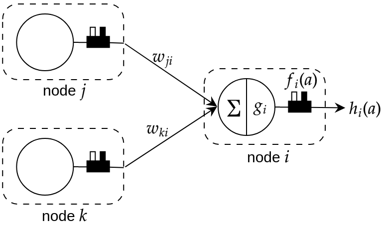
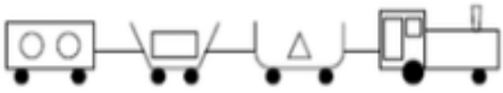
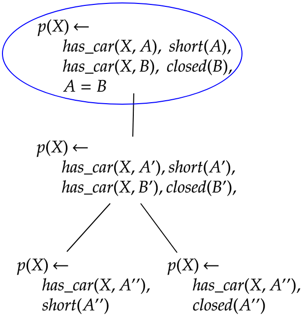

# Compositional Relational Machine (CRM)

Code and Data repository for our paper titled "Composition of Relational Features with an Application to Explaining Black-Box Predictors".[arXiv](https://arxiv.org/abs/2206.00738)
The paper is under review (status: Revision submitted) at the Machine Learning Journal (MLJ). We will update the link of the paper, once the paper is accepted and published officially.
Our repository of CRM [here](https://github.com/Devanshu24/crm) might not be maintained. The current repository is intended to be up-to-date with our newer results and further research extensions. Keep watching! 

**What is a CRM?**

CRMs are *explainable* deep neural networks, a neurosymbolic architecture in which each node in a neural network has an associated relational feature. While being independently explainable in nature, CRMs can also be used for generating structured proxy explanations for a black-box predictor.

A CRM consists of CRM-nodes (or CRM-neurons), where each node is associated with a valuation of a *relational feature*. A illustrative figure is as shown below:
<p align="center" width="100%">
    
</p>

**Explanations Generated by CRM**

Given a (relational) data instance representing a train with some cars and their properties, as shown below, a CRM generates structed explanations shown below.
<p align="center"  width="100%">
    
</p>
Structured explanation:
<p align="center"  width="100%">
    
</p>

For more information on how this done, please read the paper.

## Authors

- CRM's core codebase is developed jointly with Devanshu Shah @Devanshu24.

## How to run our code

Environment setup: `requirements.txt`

```console
$ python3 main.py -h
usage: main.py [-h] -f FILE -o OUTPUT -n NUM_EPOCHS [-s SAVED_MODEL] [-e] [-v] [-g]

CRM; Example: python3 main.py -f inp.file -o out.file -n 20 -s saved_model.pt -e -v

optional arguments:
  -h, --help            show this help message and exit
  -f FILE, --file FILE  input file
  -o OUTPUT, --output OUTPUT
                        output file
  -n NUM_EPOCHS, --num-epochs NUM_EPOCHS
                        number of epochs
  -s SAVED_MODEL, --saved-model SAVED_MODEL
                        location of saved model
  -e, --explain         get explanations for predictions
  -v, --verbose         get verbose outputs
  -g, --gpu             run model on gpu

```
You maybe able to see some example commands in `command.hist` for reference.

**Caution!** Some result or model files might get overwritten. Check the directory structure before running. Honestly, we didn't do proper care on this aspect. Over time, we will fix this simple thing. Also, our results get saved in `./data` directory, which is not a good thing. We will work on these :-)

## How to cite our paper

Bibtex:
```
@article{srinivasan2022composition,
  title={Composition of Relational Features with an Application to Explaining Black-Box Predictors},
  author={Srinivasan, Ashwin and Baskar, A and Dash, Tirtharaj and Shah, Devanshu},
  journal={arXiv preprint arXiv:2206.00738},
  year={2022}
}
```

APA:
```
Srinivasan, A., Baskar, A., Dash, T., & Shah, D. (2022). Composition of Relational Features with an Application to Explaining Black-Box Predictors. arXiv preprint arXiv:2206.00738.
```
