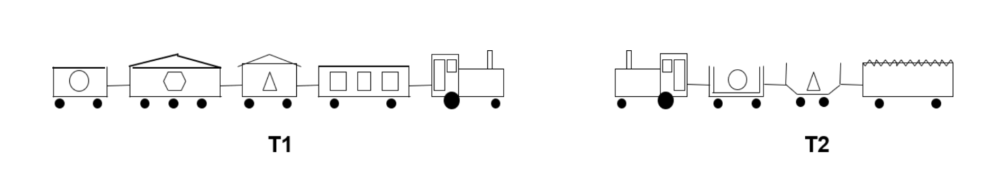

# Compositional Relational Machine (CRM)

<p align="center" width="100%">

</p>

[](https://github.com/tirtharajdash/crm/blob/main/LICENSE)
[](https://github.com/psf/black)
[](https://arxiv.org/abs/2206.00738)

Code and Data repository for our paper titled _Composition of Relational Features with an Application to Explaining Black-Box Predictors_.

The paper is under review (status: Revision submitted) at the Machine Learning Journal (MLJ). We will update the link to the paper once the paper is accepted and published officially.

Our repository of CRM [here](https://github.com/Devanshu24/crm) might not be maintained. The current repository is intended to be up-to-date with our newer results and further research extensions. Keep watching!

## What is a CRM?

CRMs are _explainable_ deep neural networks, a neurosymbolic architecture in which each node in a neural network has an associated relational feature. While being independently explainable in nature, CRMs can also be used for generating structured proxy explanations for a black-box predictor.

A CRM consists of CRM-nodes (or CRM-neurons), where each node is associated with a valuation of a _relational feature_. An illustrative figure is shown below:

<p align="center" width="100%">
    
</p>

Every neuron has an arithmetic part $\Sigma$ and a logical part $f_i(a)$. The arithmetic part acts as it would in any standard neural network, it is formed by $w_{ji}h_j(a_j) + w_{ki}h_k(a_k)$, the logical part is what is derived is a deterministic function of the data instance $x$. Hence, for a neuron($n_i$) with two ancestor neurons($n_j, n_k$) the final output would be

$$
h_i(a_i) = g_i(w_{ji}h_j(a_j) + w_{ki}h_k(a_k)) \times f_i(a)
$$

Let us consider an example problem from the paper to illustrate the workings of a CRM.

### The Train Problem

The "East-West Challenge" (Michie et al., 1994), participants were supposed to distinguish eastbound trains from westbound ones using properties of the carriages and their loads (the engine’s properties are not used), using pictorial descriptions like these (T1 is eastbound and T2 is westbound):

<p align="center" width="100%">
    
</p>

Our CRM aims to take these features as input, predict the direction of the train, and generate explanations for the prediction.

The first layer of the CRM is composed of primitive features, like

```math
\begin{align*}
    C_1 &: p(X) \leftarrow (has\_car(X,Y), short(Y)) \\
    C_2 &: p(X) \leftarrow  (has\_car(X,Y), closed(Y)) \\
    C_3 &: p(X) \leftarrow  (has\_car(X,Y), short(Y), closed(Y)) \\
    C_4 &: p(X) \leftarrow  (has\_car(X,Y), has\_car(X,Z),  short(Y), closed(Z))
\end{align*}
```

Here, we will assume that predicates like $has\_car/2$, $short/1$, $closed/1$,
$long/1$, $has\_load/3$, etc., are defined as part of the background $B$,
and capture the situation
shown diagrammatically. That is,

```math
\begin{align*}
    B = \{~ & has\_car(t1,c1\_1), has\_car(t1,c1\_2), \ldots \\
            & long(c1\_1), closed(c1\_1), has\_load(c1\_1,square,3), \ldots \\
            & has\_car(t2,c2\_1), has\_car(t2,c2\_2), \ldots ~\}.
\end{align*}
```

Then the corresponding feature-function values are:

$$
\begin{align*}
    f_{C_1,B}(t1) = f_1(t1) = 1; &~ f_1(t2) = 1; \\
    f_{C_2,B}(t1) = f_2(t1) = 1; &~ f_2(t2) = 1; \\
    f_{C_3,B}(t1) = f_3(t1) = 1; &~ f_3(t2) = 0; \\
    f_{C_4,B}(t1) = f_4(t1) = 1; &~ f_4(t2) = 1.
\end{align*}
$$

Given a way to generate the predicate part of the CRM, the arithmetic part is generated using the same way as in a standard neural network using backpropagation, with each neuron ($n_i$) being _dropped out_ based on its predicate function ($f_i$).

## Explanations Generated by CRM

Given a (relational) data instance representing a train with some cars and their properties, as shown below, a CRM generates structured explanations shown below.

<p align="center"  width="100%">
    
</p>

We use Layerwise-Relevance Propagation (LRP) (Bach et al., 2015; Binder
et al., 2016) to calculate the most relevant neurons in the penultimate layer of the CRM, just before the final two neuron classification layer. We then find the ancestral graph of this neuron to explain the prediction.

### Explaination ancestral graph

<p align="center"  width="100%">
    
</p>

## Authors

- CRM's core codebase is developed jointly with Devanshu Shah [@Devanshu24](https://github.com/Devanshu24).

## How to run our code

Environment setup: `requirements.txt`

```console
$ python3 main.py -h
usage: main.py [-h] -f FILE -o OUTPUT -n NUM_EPOCHS [-s SAVED_MODEL] [-e] [-v] [-g]

CRM; Example: python3 main.py -f inp.file -o out.file -n 20 -s saved_model.pt -e -v

optional arguments:
  -h, --help            show this help message and exit
  -f FILE, --file FILE  input file
  -o OUTPUT, --output OUTPUT
                        output file
  -n NUM_EPOCHS, --num-epochs NUM_EPOCHS
                        number of epochs
  -s SAVED_MODEL, --saved-model SAVED_MODEL
                        location of saved model
  -e, --explain         get explanations for predictions
  -v, --verbose         get verbose outputs
  -g, --gpu             run model on gpu

```

For reference, some example commands are in `command.hist`.

**Caution!** Some result or model files might get overwritten. Check the directory structure before running. Honestly, we did not properly care about this aspect. Over time, we will fix this simple thing. Also, our results get saved in the `./data` directory, which is not good. We will work on these :-)

## How to cite our paper

Bibtex:

```
@article{srinivasan2022composition,
  title={Composition of Relational Features with an Application to Explaining Black-Box Predictors},
  author={Srinivasan, Ashwin and Baskar, A and Dash, Tirtharaj and Shah, Devanshu},
  journal={arXiv preprint arXiv:2206.00738},
  year={2022}
}
```
